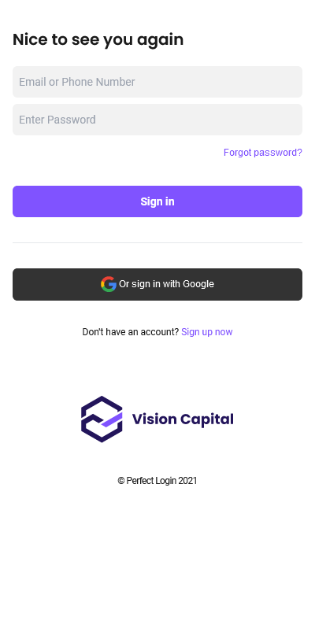
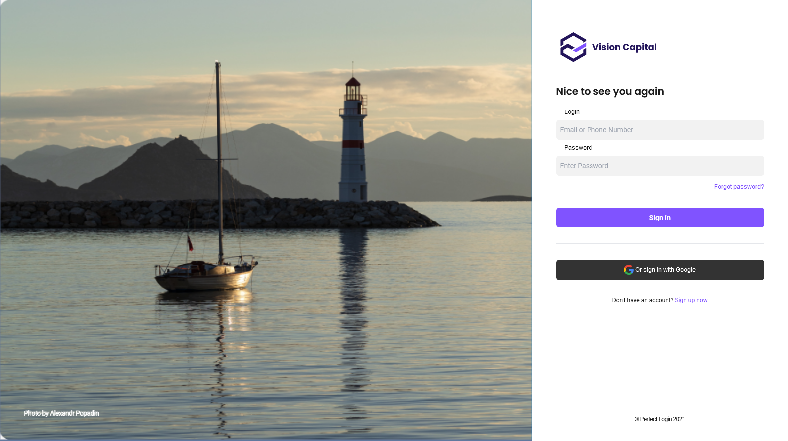

# HSBC Assignment #1: HTML and CSS (& Tailwind CSS)

This is the solution of HSBC Assignment #1: HTML and CSS (& Tailwind CSS). In this assignment, students were asked to build a simple landing page. 

## Table of contents

- [Overview](#overview)
  - [The challenge](#the-challenge)
  - [Screenshot](#screenshot)
  - [Links](#links)
- [My process](#my-process)
  - [Built with](#built-with)
  - [What I learned](#what-i-learned)

## Overview

### The challenge

Page should have:

- Identical look with its figma design
- Responsive design

### Screenshot

### Links

- [Github repo](https://github.com/nurmarief/hsbc-assignment-1/)
- [Live site](https://nurmarief.github.io/hsbc-assignment-1/)

## My process

### Built with

- Semantic HTML5 markup
- Tailwind CSS
- BEM CSS (for reusing tailiwind style)
